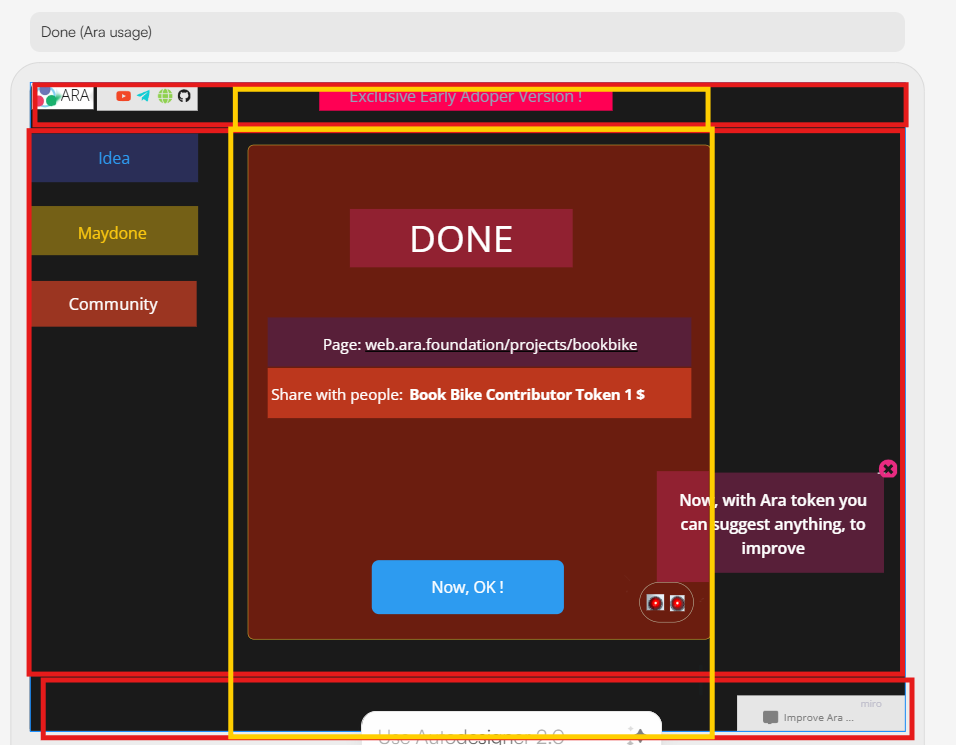

# Ara Web

A collaboration platform with the financial transparency, community building and custom AI agents for your needs.

To export the data:

```
docker-compose run atomic-server export -p /atomic-storage-export/data.json
```

To run the development mode:

```
docker-compose up -d
```

## Features

- 🤖 End user made custom AI agents
- 📝 Ara Web is Open Source
- 🛠️ Blockchain based transparency
- 🔌 Community: contributors, freelancers or monetization
- 🔒 Secure by default

### Features of the Web

- Responsive design
- Scores A or A+ (depending on hosting and your images) on [Accessify](https://www.accessify.com/) and [Ecograder](https://ecograder.com/)
- Clean and minimal
- Fluid typography
- Dark and light mode (chosen by user's system preference)
- About page
- Now page (inspired by [nownownow.com](https://nownownow.com))
- Microblog for found links (Today I Found...)
- Blog for personal projects


## Getting Started

First, install the packages:

```bash
npm install
```

Then, run the development server:

```bash
npm run dev
```

Open [http://localhost:3000](http://localhost:3000) with your browser to see the result.

## Documentation

### Architecture
Let's first explain the components that made up the Ara Web.

The background is the same for all pages.
All pages have the same classic web layout: `Header`, `Content`, `Footer`.
Each layout also composed of three sections: `Left`, `Center`, `Right`.

Below is the mockup with the rectangles defining layouts and sections. Red rectangles define the layouts. Yellow rectangles define the sections.



---

## Getting Started

1. Install dependencies:

```bash
npm install
```

2. Start the development server:

```bash
npm run dev
```

3. Build for production:

```bash
npm run build
```

## Customization

- Add your own avatar in the `public/` directory
- Edit `src/config.ts` to use your website, name, and description
- Edit pages in `src/pages/`
- Modify the layout in `src/layouts/Layout.astro`
- Update styles in the respective component files
- Make your own favicons with https://realfavicongenerator.net/

## Colors

The colors were chosen using several tools to insure accessibility and contrast. The colors are all set using variables for dark and light in the global.css file. Personally, I created the palletes and gradients using these tools:

- https://colorffy.com/color-scheme-generator
- https://www.learnui.design/tools/accessible-color-generator.html
- https://colorffy.com/mesh-gradient-generator (for the background gradient)

## Credits

Built by Tim Eaton - [timeaton.dev](https://timeaton.dev).

Anonymous Avatar by <a href="/photographer/maniskis12-68558">maniskis12</a> on <a href="/">Freeimages.com</a>

All dummy text and posts generated with Claude AI.

## License

MIT
