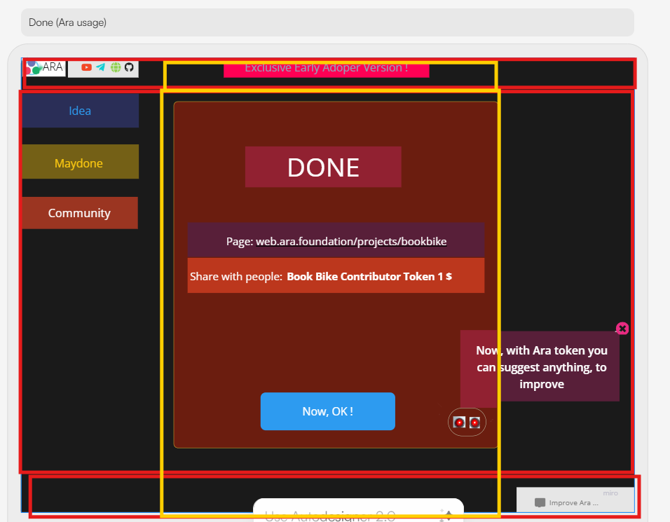

# Ara Web

A collaboration platform with the financial transparency, community building and custom AI agents for your needs.

## Features

- 🤖 End user made custom AI agents
- 📝 Ara Web is Open Source
- 🛠️ Blockchain based transparency
- 🔌 Community: contributors, freelancers or monetization
- 🔒 Secure by default

## Getting Started

First, install the packages:

```bash
npm install
```

Then, run the development server:

```bash
npm run dev
```

Open [http://localhost:3000](http://localhost:3000) with your browser to see the result.

## Documentation

### Architecture
Let's first explain the components that made up the Ara Web.

The background is the same for all pages.
All pages have the same classic web layout: `Header`, `Content`, `Footer`.
Each layout also composed of three sections: `Left`, `Center`, `Right`.

Below is the mockup with the rectangles defining layouts and sections. Red rectangles define the layouts. Yellow rectangles define the sections.



## Contributing

We welcome contributions! Please see our contributing guidelines for details.

## License

MIT License - see [LICENSE](LICENSE) for details.
